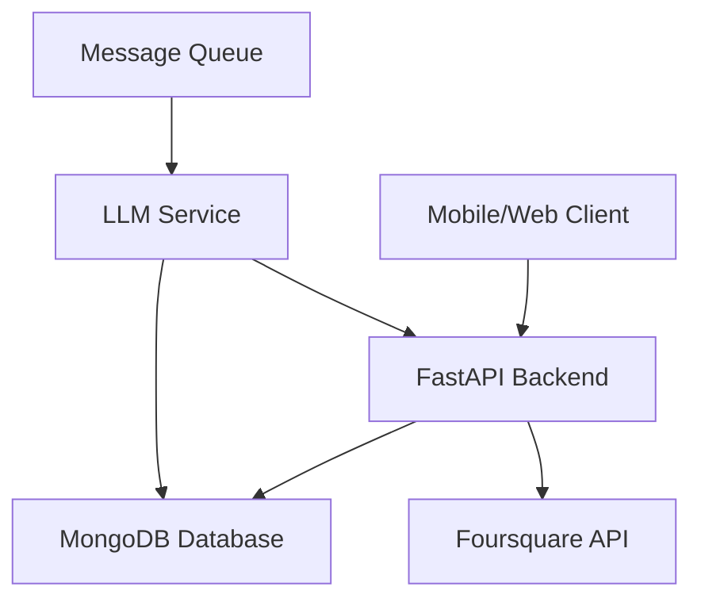

# 🍽️ Dinemate

**An AI-powered group dining recommendation platform that learns from conversations to suggest perfect restaurants for groups.**

[](https://fastapi.tiangolo.com/)
[](https://www.python.org/)
[](https://www.mongodb.com/)
[](https://beanie-odm.dev/)

## 📖 Table of Contents

- [Overview](#overview)
- [Features](#features)
- [Architecture](#architecture)
- [Quick Start](#quick-start)
- [API Documentation](#api-documentation)
- [Project Structure](#project-structure)
- [Contributing](#contributing)

## 🎯 Overview

Dinemate is a sophisticated group dining platform that uses AI to learn user preferences from group chat conversations. The system intelligently aggregates individual preferences to suggest restaurants that satisfy the entire group's needs.

### Key Concepts
- **Group Chats**: Users create or join dining groups with unique invite codes
- **AI Learning**: LLM monitors conversations to understand user preferences
- **Smart Aggregation**: Combines individual preferences into group recommendations
- **Restaurant Integration**: Uses Foursquare API for restaurant data

## ✨ Features

### 🤝 Group Management
- Create dining groups with invite codes
- Join groups seamlessly 
- Real-time group chat functionality
- Member management and tracking

### 🧠 AI-Powered Learning
- **Automatic Preference Detection**: LLM analyzes chat messages
- **Contextual Understanding**: Learns dietary restrictions, cuisine preferences, budget
- **Group Dynamics**: Understands group-specific preferences vs individual
- **Confidence Scoring**: Tracks reliability of learned preferences

### 🍴 Smart Recommendations
- **Preference Aggregation**: Combines all group members' preferences
- **Constraint Satisfaction**: Handles dietary restrictions and budget limits
- **Location-Aware**: Considers group location and accessibility
- **Real-time Updates**: Preferences update as conversations evolve

### 🔐 User Management
- Firebase authentication integration
- Personalized user profiles
- Onboarding preference collection
- Cross-group preference tracking

## 🏗️ Architecture



### Tech Stack
- **Backend**: FastAPI (Python)
- **Database**: MongoDB with Beanie ODM
- **Authentication**: Firebase Auth
- **External APIs**: Foursquare Places
- **AI/ML**: Background LLM service (Celery/similar)
- **Real-time**: WebSocket support

## 🚀 Quick Start

### Prerequisites
- Python 3.8+
- MongoDB instance
- Firebase project
- Foursquare API key

### Installation

1. **Clone the repository**
   ```bash
   git clone <repository-url>
   cd Dinemate
   ```

2. **Set up virtual environment**
   ```bash
   python -m venv venv
   source venv/bin/activate  # Windows: venv\\Scripts\\activate
   ```

3. **Install dependencies**
   ```bash
   pip install -r requirements.txt
   ```

4. **Configure environment**
   ```bash
   cp .env.example .env
   # Edit .env with your configuration
   ```

5. **Run the server**
   ```bash
   uvicorn app.main:app --reload
   ```

## 📚 API Documentation

### Base URL
```
http://localhost:8000/api/v1
```

### Quick Reference

| Endpoint | Method | Description |
|----------|--------|-------------|
| [`/groups/`](docs/api/groups.md#create-group) | POST | Create new group |
| [`/groups/join`](docs/api/groups.md#join-group) | POST | Join group with invite code |
| [`/users/{firebase_id}/groups`](docs/api/users.md#get-user-groups) | GET | Get user's groups |
| [`/groups/{group_id}`](docs/api/groups.md#get-group-detail) | GET | Get group details |
| [`/groups/{group_id}/messages`](docs/api/groups.md#send-message) | POST | Send message |
| [`/groups/{group_id}/aggregated-preferences`](docs/api/group-preferences.md#get-aggregated-preferences) | GET | Get group preferences |

### Detailed Documentation
- **[Groups API](docs/api/groups.md)** - Group management endpoints
- **[Users API](docs/api/users.md)** - User management endpoints  
- **[Group Preferences API](docs/api/group-preferences.md)** - Preference aggregation
- **[Restaurants API](docs/api/restaurants.md)** - Restaurant search and data

## 📁 Project Structure

```
Dinemate/
├── app/
│   ├── api/v1/              # API route handlers
│   ├── core/                # Core configuration
│   ├── models/              # Database models
│   ├── schemas/             # Pydantic schemas
│   ├── services/            # Business logic
│   ├── config.py           # Configuration
│   ├── database.py         # Database setup
│   └── main.py             # FastAPI app
└── requirements.txt        # Dependencies
```

### Key Components

#### [Models](docs/models/README.md)
- **[User](docs/models/user.md)** - User profiles and authentication
- **[Group](docs/models/group.md)** - Group management and chat
- **[GroupPreferences](docs/models/group-preferences.md)** - AI-learned preferences

#### [Services](docs/services/README.md)
- **[GroupService](docs/services/group-service.md)** - Group operations
- **[UserService](docs/services/user-service.md)** - User management
- **[GroupPreferencesService](docs/services/group-preferences-service.md)** - Preference aggregation
- **[AuthService](docs/services/auth-service.md)** - Authentication logic
- **[FoursquareService](docs/services/foursquare-service.md)** - Restaurant data

## 🔧 Configuration

### Environment Variables
```bash
# Database
DATABASE_URL=mongodb://localhost:27017
DATABASE_NAME=dinemate

# Firebase
FIREBASE_PROJECT_ID=your-project-id
FIREBASE_PRIVATE_KEY_ID=your-key-id

# Foursquare
FOURSQUARE_API_KEY=your-api-key

# App Settings
DEBUG=True
SECRET_KEY=your-secret-key
```

---

**Built with ❤️ for better group dining experiences**
